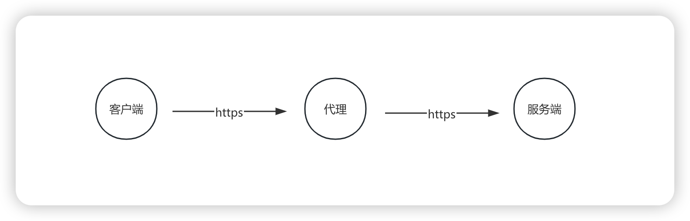
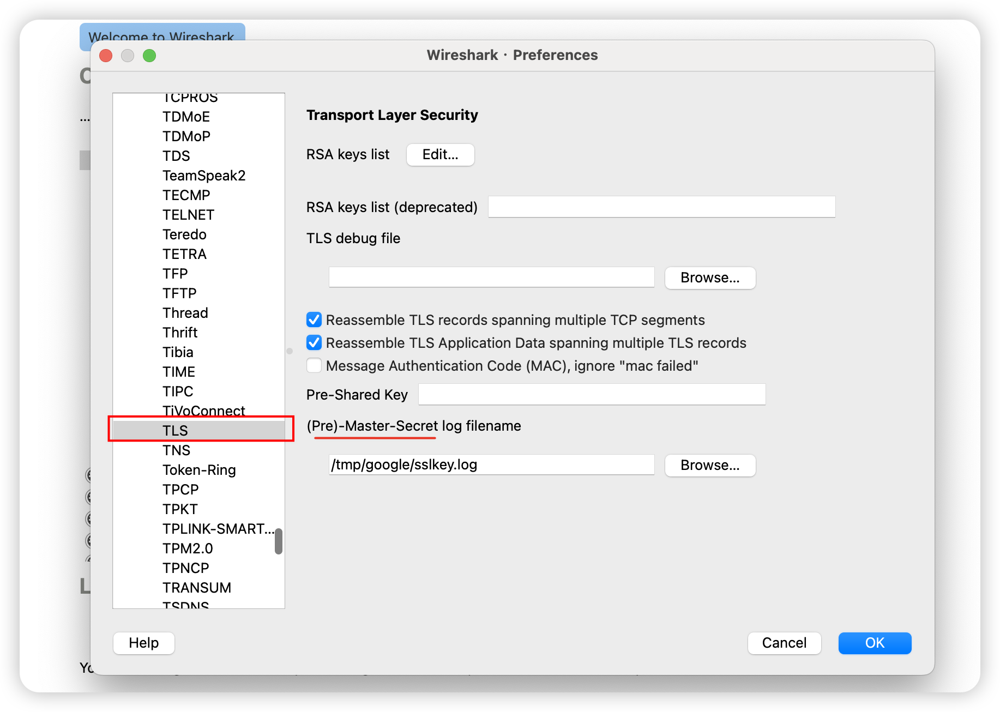
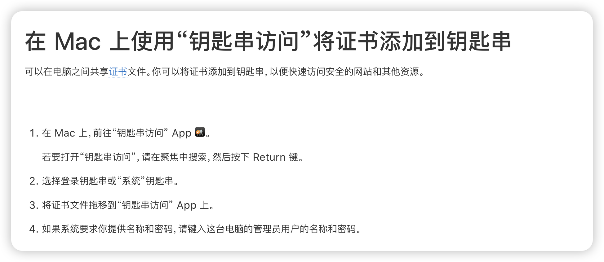
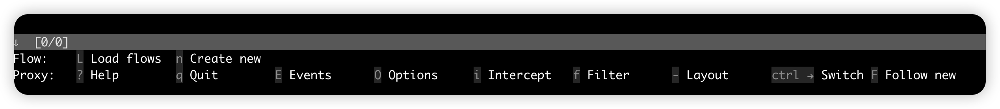

要正确地抓包其实并不容易，如果只是HTTP接口的话，问题好像要简单很多，但涉及到HTTPS的话，数据的编解码就很费解。抓包的工具有很多选择，周围的很多人都在使用 Charles，付费软件的体验一般都比较好，这可能也是大家选择付费的原因。

除了付费的软件外，还有很多免费的工具，比如文章介绍的mitmproxy，以及Wireshark、tcpdump等。我每个工具都使用过，但每个工具都用不好，这本身就很糟糕，但自己不自知。一句废话送给读到这篇博客的各位：

> 不广求，故得；不杂学，故名

## https 编解码

HTTPS交互引入了数据加密，对称加密、非对称加密、数字证书等内容，理解它的基本原理可以帮助我们理解网络抓包。

什么是对称加密？我的理解是“一把锁两把钥匙”，你和我做安全交易，我们都可以把东西锁起来，通过公开的途径邮寄给对方，对方收到后，用钥匙直接打开。但你和我在网络上是两个不熟悉人，我买了锁之后怎么把钥匙给你就很困难。

什么是非对称加密？我的理解是“一把锁一把钥匙”，你和我做安全交易，你拿锁，我拿钥匙，你把东西锁起来然后邮寄给我，我用钥匙直接打开。但是，如果我要给你邮寄东西怎么办呢？还需要另外一把锁和钥匙，这次换我拿锁，你拿钥匙。

对于非对称加密的比喻，还是不够全面，缺点意思。分对称加密有公钥和私钥，公钥加密的数据必须使用私钥进行解密；私钥加密的数据，必须使用公钥解密；但公钥是公开的，任何人都可以获取到，私钥加密、公钥解密的意义就很不明确。

如果我们抓包想要显示加密传输的内容，需要将抓包工具当做一个代理来使用，如果使用Wireshark抓包，该如何设置代理以及展示传输的内容呢？首先要给这个工具一个定位：Wireshark 可以作为一个网络代理吗？

我查阅了一下，Wireshark 本身并不是一个网络代理，它无法代理和转发网络流量，它通常被用作网络分析工具，用来捕获和分析网络通讯数据包。

基于我认知的角度来说，在https协商秘钥的过程中，总共有3个随机数：客户端的随机数、服务端的随机数、以及pre-master随机数，因为pre-master是加密传输的的，Wireshark应该是不知道的。所以在Wireshark解析TLS协议的配置项中，可以指定 pre-master-secret log file。难道这个文件的内部是明文？

选择使用mitmproxy抓包，只需要安装信任证书，就可以正常查看https的请求。或者，如果不行的话，可以尝试重启下机器。

## mitmproxy

介绍一款非常好用的抓包工具，官网地址：[https://www.mitmproxy.org](https://www.mitmproxy.org)。实际上，在调试苹果`IAP`支付时，始终没有抓成功过，反而因为设置了代理，导致苹果`沙盒用户`无法成功支付。它名字的全拼是`Man-in-the-middle-proxy`，代表中间人攻击。

要顺利抓包，最关键的步骤是安装证书，我是macOs笔记本电脑，只需要安装官方的介绍进行安装。mitmproxy 的CA证书被安装在home目录下的`~/.mitmproxy`中，证书文件`mitmproxy-ca-cert.pem`拖动到钥匙串访问中，注意点击始终信任

最近重新拾起抓包还是因为大模型，市面上有很多代码自动生成插件，就拿自动生成单元测试来说，那些插件究竟提交给了大模型哪些代码，我想通过网络抓包来一探究竟。很开心的是，确实可以抓到。

而且，我发现 mitmproxy 的命令行操作其实特别间接，很多操作通过快捷键就搞定了，最主要是，你不用担心忘记快捷键，快捷键就在界面的最下栏。最让我用起来感觉比较棒的地方，是查看单个请求的请求头或者请求体，一键进入编辑模式，再配合 sublime，感觉自己马上就要起飞了。

更给人意外的是，mitmproxy官方文档中还介绍到了wireshark，mitmproxy支持将 SSL/TLS master keys 记录到指定的文件以便提供给 Wireshark 解密 SSL/TLS 的数据包。不过，我觉得，mitmproxy已经完全可以了，就没有理由再去鼓捣一下 Wireshark了

## 常用的快捷键

1. 在列表界面，按`回车`进入详情界面
2. 在详情界面，按`q`返回列表界面
3. 在详情界面，按`tab`键在`Request`,`Response`,`Detail`三个`tab`之间切换。按`j`，`k`可以滚动查看详情.
4. 在列表界面，按`G`跳到最新一个请求
5. 在列表界面，按`g`跳到第一个请求
6. 在列表界面，按`d`删除当前选中的请求，按`D`恢复刚才删除的请求
7. 在列表界面，按`z`清空请求列表

## 常用的过滤表达式

列表界面,按`f`进入过滤模式。详细的过滤表达式，可以查看：[`Filter expressions`](https://docs.mitmproxy.org/stable/concepts-filters/)。

1. `~h regex	Header`
2. `~u regex	URL`
3. `~m regex    Method`

## 原理

 1. [Subject Alternative Name](https://en.wikipedia.org/wiki/Subject_Alternative_Name)：is an extension to X.509 that allows various values to be associated with a security certificate using a subjectAltName field. These values are called Subject Alternative Names (SANs). Names include
 2. [Server Name Indication](https://en.wikipedia.org/wiki/Server_Name_Indication)： is an extension to the TLS computer networking protocol by which a client indicates which hostname it is attempting to connect to at the start of the handshaking process. This allows a server to present multiple certificates on the same IP address and TCP port number and hence allows multiple secure (HTTPS) websites (or any other service over TLS) to be served by the same IP address without requiring all those sites to use the same certificate. 

