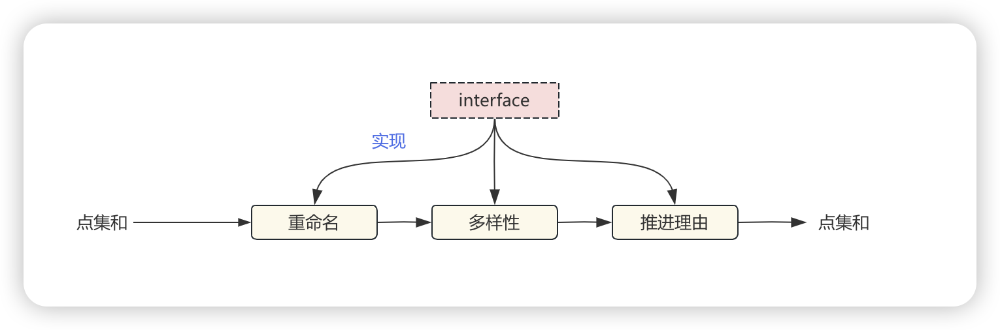

在开发代码的时候，其实我很少会思考：要实现这个功能，究竟要如何设计组织代码以满足高内聚低耦合，设计扩展性高的架构。但我有时又会去想，我现在这样的设计究竟属于哪种设计模式。我快速翻看了极客时间上关于王争《设计模式之美》，有时候可以回过神来结合程序思考一下。

## 设计模式

创建型设计模式主要解决“对象的创建”问题，结构型设计模式主要解决“类或对象的组合或组装”问题，那行为型设计模式主要解决的就是“类或对象之间的交互”问题。

前面我们已经学习了很多设计模式，不知道你有没有发现，实际上，设计模式要干的事情就是解耦。创建型模式是将创建和使用代码解耦，结构型模式是将不同功能代码解耦，行为型模式是将不同的行为代码解耦，具体到观察者模式，它是将观察者和被观察者代码解耦

### 代理模式

代理模式（Proxy Design Pattern）的原理和代码实现都不难掌握。它在不改变原始类（或叫被代理类）代码的情况下，通过引入代理类来给原始类附加功能。一般情况下，我们让代理类和原始类实现同样的接口。但是，如果原始类并没有定义接口，并且原始类代码并不是我们开发维护的。在这种情况下，我们可以通过让代理类继承原始类的方法来实现代理模式。

代理模式最常用的一个应用场景就是，在业务系统中开发一些非功能性需求，比如：监控、统计、鉴权、限流、事务、幂等、日志。我们将这些附加功能与业务功能解耦，放到代理类中统一处理，让程序员只需要关注业务方面的开发。实际上，前面举的搜集接口请求信息的例子，就是这个应用场景的一个典型例子

### 装饰器模式

装饰器模式主要解决继承关系过于复杂的问题，通过组合来替代继承。它主要的作用是给原始类添加增强功能。这也是判断是否该用装饰器模式的一个重要的依据。除此之外，装饰器模式还有一个特点，那就是可以对原始类嵌套使用多个装饰器。为了满足这个应用场景，在设计的时候，装饰器类需要跟原始类继承相同的抽象类或者接口。

```
// 装饰器模式的代码结构(下面的接口也可以替换成抽象类)
public interface IA {
  void f();
}
public class A implements IA {
  public void f() { //... }
}
public class ADecorator implements IA {
  private IA a;
  public ADecorator(IA a) {
    this.a = a;
  }
  
  public void f() {
    // 功能增强代码
    a.f();
    // 功能增强代码
  }
}
```

### 适配器模式

适配器模式的英文翻译是Adapter Design Pattern。顾名思义，这个模式就是用来做适配的，它将不兼容的接口转换为可兼容的接口，让原本由于接口不兼容而不能一起工作的类可以一起工作。对于这个模式，有一个经常被拿来解释它的例子，就是USB转接头充当适配器，把两种不兼容的接口，通过转接变得可以一起工作。

原理很简单，我们再来看下它的代码实现。适配器模式有两种实现方式：类适配器和对象适配器。其中，类适配器使用继承关系来实现，对象适配器使用组合关系来实现。具体的代码实现如下所示。其中，ITarget表示要转化成的接口定义。Adaptee是一组不兼容ITarget接口定义的接口，Adaptor将Adaptee转化成一组符合ITarget接口定义的接口。

### 门面模式

门面模式为子系统提供一组统一的接口，定义一组高层接口让子系统更易用。这个定义很简洁，我再进一步解释一下。

假设有一个系统A，提供了a、b、c、d四个接口。系统B完成某个业务功能，需要调用A系统的a、b、d接口。利用门面模式，我们提供一个包裹a、b、d接口调用的门面接口x，给系统B直接使用。

### 组合模式

组合模式跟我们之前讲的面向对象设计中的“组合关系（通过组合来组装两个类）”，完全是两码事。这里讲的“组合模式”，主要是用来处理树形结构数据。这里的“数据”，你可以简单理解为一组对象集合

正因为其应用场景的特殊性，数据必须能表示成树形结构，这也导致了这种模式在实际的项目开发中并不那么常用。

两种对象，包含的关系

### 享元模式

所谓“享元”，顾名思义就是被共享的单元。享元模式的意图是复用对象，节省内存，前提是享元对象是不可变对象。

具体来讲，当一个系统中存在大量重复对象的时候，如果这些重复的对象是不可变对象，我们就可以利用享元模式将对象设计成享元，在内存中只保留一份实例，供多处代码引用。这样可以减少内存中对象的数量，起到节省内存的目的。实际上，不仅仅相同对象可以设计成享元，对于相似对象，我们也可以将这些对象中相同的部分（字段）提取出来，设计成享元，让这些大量相似对象引用这些享元。

这里我稍微解释一下，定义中的“不可变对象”指的是，一旦通过构造函数初始化完成之后，它的状态（对象的成员变量或者属性）就不会再被修改了。所以，不可变对象不能暴露任何set()等修改内部状态的方法。之所以要求享元是不可变对象，那是因为它会被多处代码共享使用，避免一处代码对享元进行了修改，影响到其他使用它的代码。


### 观察者模式

观察者模式（Observer Design Pattern）也被称为发布订阅模式（Publish-Subscribe Design Pattern）。在GoF的《设计模式》一书中，它的定义是这样的：

Define a one-to-many dependency between objects so that when one object changes state, all its dependents are notified and updated automatically.

翻译成中文就是：在对象之间定义一个一对多的依赖，当一个对象状态改变的时候，所有依赖的对象都会自动收到通知。

一般情况下，被依赖的对象叫作被观察者（Observable），依赖的对象叫作观察者（Observer）。不过，在实际的项目开发中，这两种对象的称呼是比较灵活的，有各种不同的叫法，比如：Subject-Observer、Publisher-Subscriber、Producer-Consumer、EventEmitter-EventListener、Dispatcher-Listener。不管怎么称呼，只要应用场景符合刚刚给出的定义，都可以看作观察者模式。

### 模版模式

模板方法模式在一个方法中定义一个算法骨架，并将某些步骤推迟到子类中实现。模板方法模式可以让子类在不改变算法整体结构的情况下，重新定义算法中的某些步骤。

原理很简单，代码实现就更加简单，我写了一个示例代码，如下所示。templateMethod()函数定义为final，是为了避免子类重写它。method1()和method2()定义为abstract，是为了强迫子类去实现。不过，这些都不是必须的。

### 策略模式

策略模式。在实际的项目开发中，这个模式也比较常用。最常见的应用场景是，利用它来避免冗长的if-else或switch分支判断。不过，它的作用还不止如此。它也可以像模板模式那样，提供框架的扩展点等等。

定义一族算法类，将每个算法分别封装起来，让它们可以互相替换。策略模式可以使算法的变化独立于使用它们的客户端（这里的客户端代指使用算法的代码

工厂模式是解耦对象的创建和使用，观察者模式是解耦观察者和被观察者。策略模式跟两者类似，也能起到解耦的作用，不过，它解耦的是策略的定义、创建、使用这三部分。

一般来讲，如果策略类是无状态的，不包含成员变量，只是纯粹的算法实现，这样的策略对象是可以被共享使用的，不需要在每次调用getStrategy()的时候，都创建一个新的策略对象。针对这种情况，我们可以使用上面这种工厂类的实现方式，事先创建好每个策略对象，缓存到工厂类中，用的时候直接返回。

相反，如果策略类是有状态的，根据业务场景的需要，我们希望每次从工厂方法中，获得的都是新创建的策略对象，而不是缓存好可共享的策略对象，那我们就需要按照如下方式来实现策略工厂类。

### 职责链模式

在职责链模式中，多个处理器（也就是刚刚定义中说的“接收对象”）依次处理同一个请求。一个请求先经过A处理器处理，然后再把请求传递给B处理器，B处理器处理完后再传递给C处理器，以此类推，形成一个链条。链条上的每个处理器各自承担各自的处理职责，所以叫作职责链模式。

第一种实现方式如下所示。其中，Handler是所有处理器类的抽象父类，handle()是抽象方法。每个具体的处理器类（HandlerA、HandlerB）的handle()函数的代码结构类似，如果它能处理该请求，就不继续往下传递；如果不能处理，则交由后面的处理器来处理（也就是调用successor.handle()）。HandlerChain是处理器链，从数据结构的角度来看，它就是一个记录了链头、链尾的链表。其中，记录链尾是为了方便添加处理器。

实际上，职责链模式还有一种变体，那就是请求会被所有的处理器都处理一遍，不存在中途终止的情况。这种变体也有两种实现方式：用链表存储处理器和用数组存储处理器，跟上面的两种实现方式类似，只需要稍微修改即可。

代码中经常使用到这种模式，对处理的逻辑做了抽象，通过链式调用的方式对数据集进行处理。多个处理器需要实现同一个接口来统一调用。



### 中介模式

中介模式定义了一个单独的（中介）对象，来封装一组对象之间的交互。将这组对象之间的交互委派给与中介对象交互，来避免对象之间的直接交互。

还记得我们在第30节课中讲的“如何给代码解耦”吗？其中一个方法就是引入中间层。

实际上，中介模式的设计思想跟中间层很像，通过引入中介这个中间层，将一组对象之间的交互关系（或者说依赖关系）从多对多（网状关系）转换为一对多（星状关系）。原来一个对象要跟n个对象交互，现在只需要跟一个中介对象交互，从而最小化对象之间的交互关系，降低了代码的复杂度，提高了代码的可读性和可维护性。