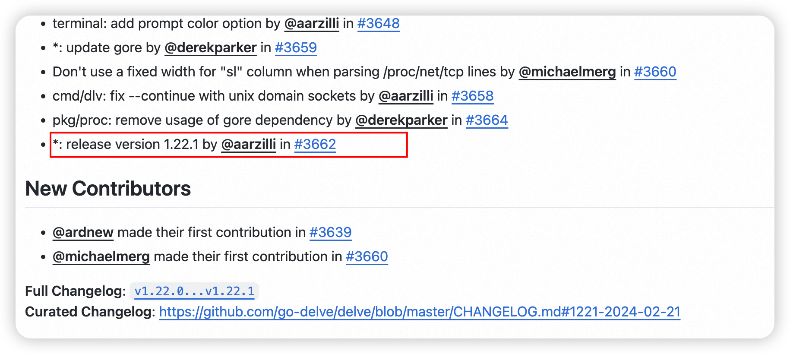
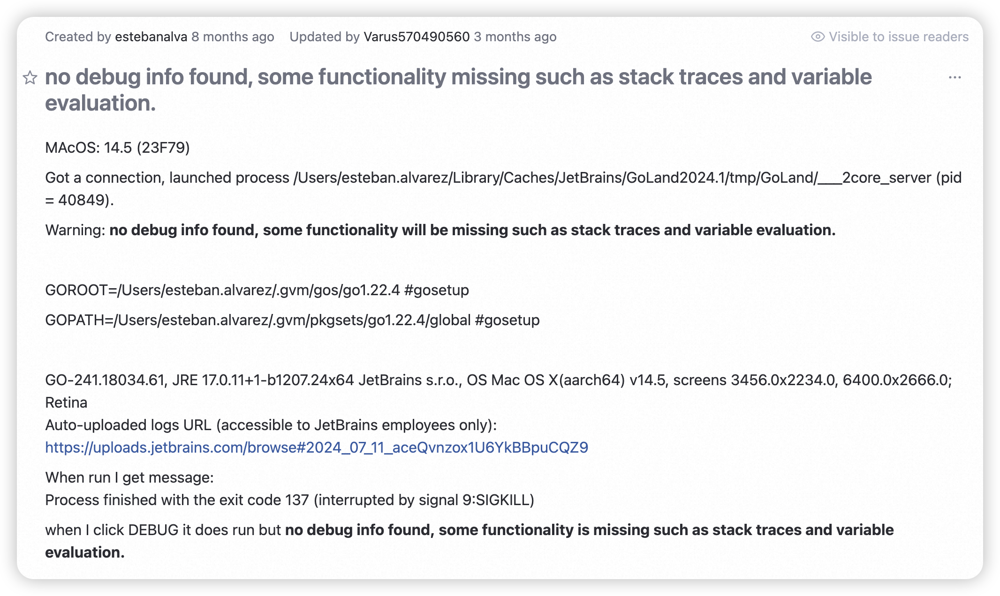
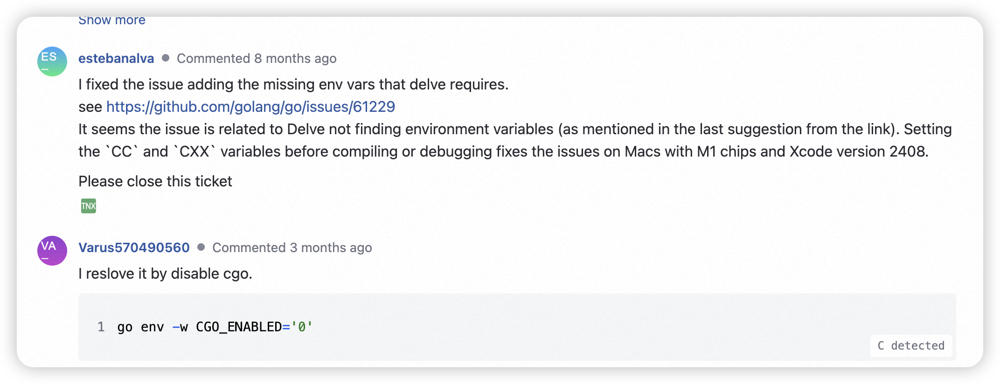
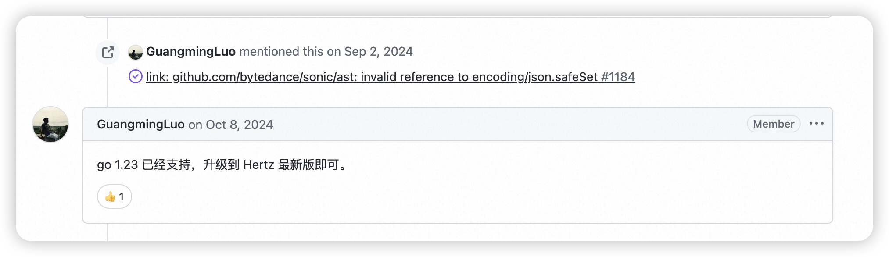
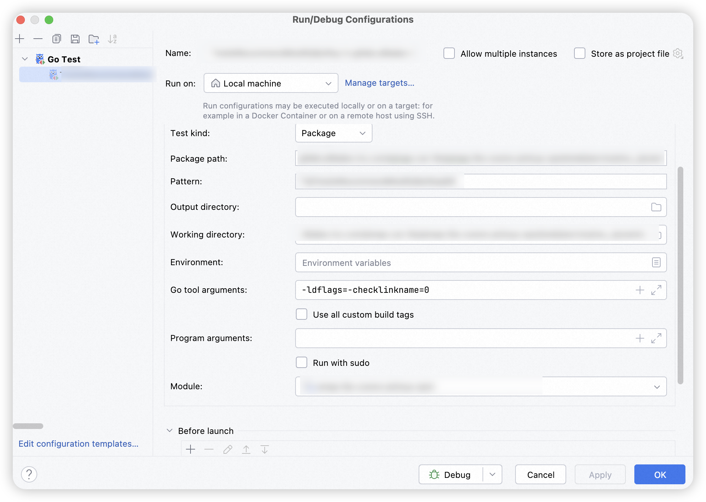

Mac上使用GoLand做项目开发，在经过一系列系统升级后发现：debug的能力失效了。当执行单测debug时控制台会输出下面的错误提示：

```shell
API server listening at: 127.0.0.1:63516
Warning: no debug info found, some functionality will be missing such as stack traces and variable evaluation.
could not launch process: could not read debug info (decoding dwarf section info at offset 0x0: too short) and could not read go symbol table (could not find rodata struct member)
```

求助大模型给出解决思路:

> 在使用goland debug程序的时候，发现debug无法正常执行，并给出了上述的报错。请帮忙分析无法正常debug的原因，并给出问题的解决思路

1. **错误信息解读**：
    - `Warning: no debug info found`：表示调试器无法找到有效的调试信息。
    - `decoding dwarf section info at offset 0x0: too short`：说明 DWARF 调试信息（用于调试的元数据）在解析时出现问题，可能是文件损坏或生成不完整。
    - `could not read go symbol table (could not find rodata struct member)`：表明调试器无法读取 Go 的符号表，可能与编译器版本或编译选项有关。
2. **可能的原因**：
    - **Go 版本问题**：某些 Go 版本可能存在与调试器兼容性的问题，尤其是当使用较新或较旧的 Go 版本时。
    - **编译选项问题**：如果编译时未启用调试信息（例如未使用 `-gcflags="all=-N -l"`），生成的二进制文件将缺少必要的调试信息。
    - **GoLand 配置问题**：GoLand 的调试器配置可能未正确设置，导致无法正确解析调试信息。
    - **环境变量问题**：某些环境变量（如 `GOROOT` 或 `GOPATH`）配置错误，可能导致调试器无法找到正确的工具链或依赖。
    - **DWARF 格式问题**：某些情况下，Go 编译器生成的 DWARF 调试信息可能与调试器不兼容。

## 升级匹配对应的dlv版本

Go debug 依赖的工具 [delve](https://github.com/go-delve/delve)，查阅了相关内容，有一种解决思路是将 dlv 升级到最新版本。查看 delve 的发版信息：  
[https://github.com/go-delve/delve/releases](https://github.com/go-delve/delve/releases)，对应的 dlv 会随着 Go 版本的发布而出新的版本，但不是一一对应的。

比如版本1.22.1的就对应了Go 1.22.1的版本，升级更新 dlv 直接执行对应的安装命令



下面我将 dlv 升级到 v1.23.0，对应的运行Go版本也切换到v1.23.0，**发现还是没有解决问题**，但对应的报错发生了变化

```shell
go install github.com/go-delve/delve/cmd/dlv@v1.23.0
```

## 升级对应的xcode-select

安装最新版本的 xcode，就像一个无头苍蝇，我重新删除了对应的文件路径，即使重新安装完成后，debug问题依然无效。

```shell
xcode-select --install
```

## 其它人遇到了同样的问题

搜索到GoLand编译器下的Issues：[no debug info found, some functionality missing such as stack traces and variable evaluation.](https://youtrack.jetbrains.com/issue/GO-17137/no-debug-info-found-some-functionality-missing-such-as-stack-traces-and-variable-evaluation.)



在问题的回复中引出了[cmd/link: issues with Apple's new linker in Xcode 15 #61229](https://github.com/login?return_to=https://github.com/golang/go/issues/61229)问题，切好我本机安装的xcode版本恰好也是 2408，看来是Xcode升级导致的问题。



控制台提示 sonic 包不兼容，之前为了性能选择使用了 sonic 来做 json 的反序列化，但优化性能的同时牺牲了未来的扩展性，一件事情总有两面。

```shell
link: github.com/bytedance/sonic/ast: invalid reference to encoding/json.safeSet
```

好在这个问题同样不是我第一次遇见，这里是对应的Issue [# go project start error #1180e](https://github.com/cloudwego/hertz/issues/1180)。最简单的处理方案当然是升级版本



我采用了另外的处理思路，因为我本地的Go版本是 1.23，通过在 Go Test模板中的编译工具中指定指令

> 这个是1.23.0 默认开启了//go:linkname 检查，通过 -ldflags=-checklinkname=0 关闭就可以了， 以下两种方式可以解决go get -u github.com/bytedance/sonic 升级这个库到最新 或 在 go build 加上 -ldflags=-checklinkname=0 即可编译通过



## Go编译缓存清理

