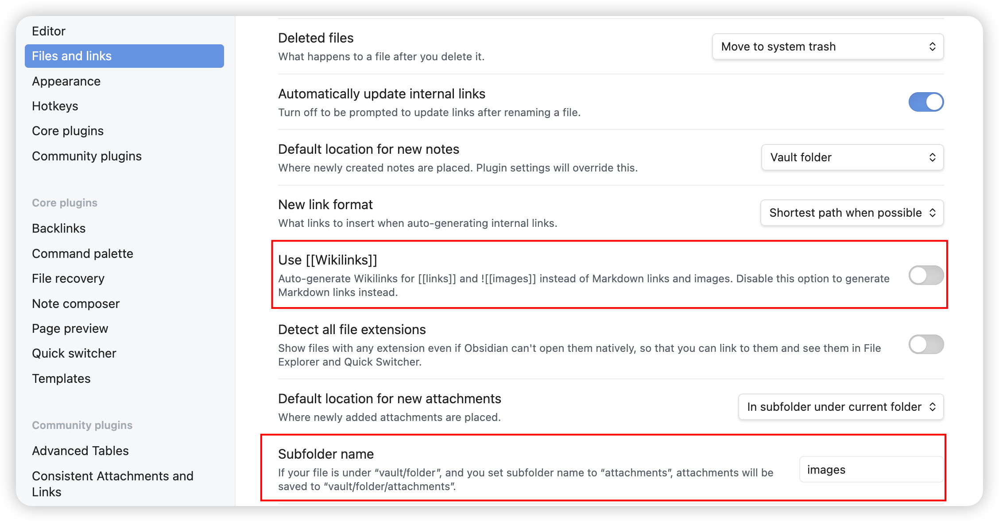

Obsidian是一个Markdown文本工具，可以免费使用。之前一直有使用Typora，但后来Typora开始收费，购买方式是一次性付费，不到100人民币吧。坦白讲，对在座的各位来说，这点钱真的不算什么，愿意购买的其实可以支持一下开发者，都挺不容易的。

我用Markdown的场景比较少，实在没有必要浪费钱，在同事的推荐下开始使用免费的Obsidian，整体下来也挺好用的。有时候会在「少数派」上查看一下大家对Obsidian的使用总结，也蛮有意思的。

后来我使用Obsidian作为hugo博客的编辑器，对它的依赖也越来越重，有时候挺担心它又开始变成收费软件了。我经常会使用到的是图片的复制功能，就是**将屏幕的截图复制到Markdown文本中，自动转换为目录下的图片**。这个功能特别好友，尤其是写Hugo博客插入图片的时候。

截图中我重点框出了两个设置项，Obsidian中使用`[[]]`的块语法兼容了Markdown标准的图片插入语法，关闭第一个选项后，图片的插入语法就变成了``，这其实是我们需要的朴素行为。

第二个选项用来将复制的图片统一管理起来。正常情况下，图片会和当前的Markdown文件在相同的目录下，而指定了Subfolder属性后，图片便会赋值到Subfolder指定的目录中。但这个里面仍然存在缺陷，