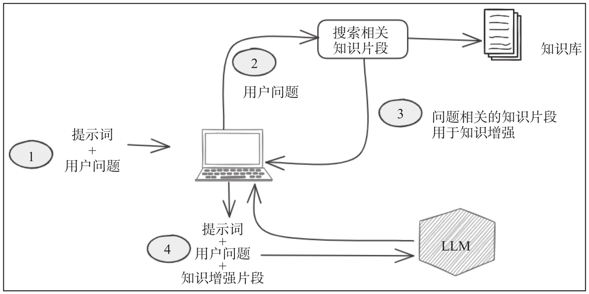
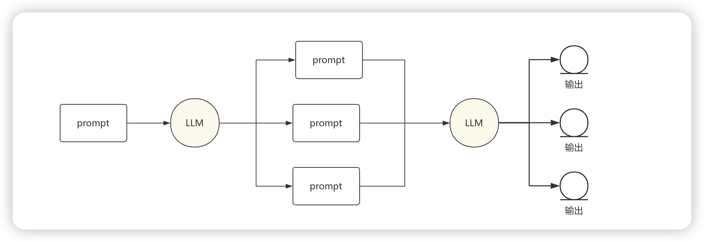
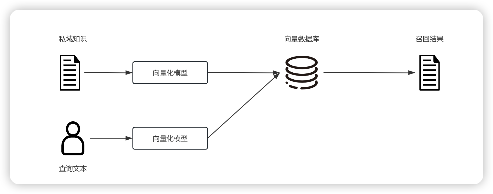

有下面的开源模型供参考：
1. Salesforce AI Research发布的Codegen
2. Llama Code
3. Stability AI公司发布的Stable Code 3B模型，代码补齐模型

模型内部的渐进式生成方案：按照 max_new_token 设定的长度限制，先生成一小段内容，推送给客户端显示，然后将之前生成的全部内容作为参数，继续调用模型的generate方法生成接下来的内容。（这里存在概念上的歧义）

关于代码参考的素材，我们首先可以确定的是当前的文件，在当前文件内搜索与当前编辑内容最相关的内容，其次相关的内容包括：
- 文件的打开历史、或者说是工作区打开的tab页
- git提交记录中的变更文件
- import语法块中文件

关于训练模型，其实并不是一件简单的事情，要训练一个Coding模型，单靠学习代码并不足以微调模型一边有效地生成代码，模型还需要其它领域的知识。而所学内容的类型和比例，我们称之为数据配比，将直接决预训练模型的最终效果。

这让我想到模型的评测指标，评测一个模型在不同方面的打分

## 知识库RAG

Retrieval-Augmentd Generation 检索增强生成框架，该框架可以使模型访问超出其训练数据范围之外的信息，使模型在每次生成时可以利用检索提供的外部更专业、更准确的知识，从而更好的回答用户的问题。

RAG是LLM内容生成的补充和完善，LLM存在的问题列举：

1. 知识更新问题，LLM通过海量的文本训练后，将这些文本以一种黑盒的方式压缩到模型自身的参数中。但这些预训练预料库内容都截止在固定的时间之前，在模型训练之后更新的知识无法囊括在大模型中。
2. 训练成本问题。LLM训练硬件资源成本不需要在强调了，这里强调软件方面，对于一个大模型来说，更新基础知识库是非常困难的一件事。首先，要保证预训练数据的质量；其次，更新知识库后的模型都需要重新训练，至少需要将新数据和旧数据按照一定的比例进行混合训练，而不能仅仅使用新数据，否则会出现灾难性遗忘
3. 生成结果的不可解释性问题

RAG在推理过程中分为两个阶段：检索和内容生成。
1. 检索阶段，通过算法检索和用户问题相关的知识片段，这里的知识片段就可以是企业私有的仓库；
2. 内容生成阶段。完成检索后，获取到了用户输入相关的可靠外部输入。在内容生成阶段，通过一个结构话的prompt模板约束，将这些外部知识添加到用户的问题中，并传递给语言模型。模型基于知识增强的prompt，通过自己的大量参数计算，就可以生成一个更准确的答案。



当前RAG操作私有的代码仓库，在数据检索阶段，我们可以搜索到最相近的K个候选集，需要有效地对这部分候选集进行过滤。另外，检索结果的相似性要符合逻辑因果上的关联性，具体到给某个函数自动生成单元测试，函数的内部实现、类依赖、调用场景，我们希望通过检索RAG来得到。

说到底，本质上是 prompt工程，通过不断优化和大模型交互的prompt来提高结果的质量。有些场景下，在我们最终提问LLM之前，我们还可以优先让LLM优化一下我们的prompt，或者让LLM给出若干个优化后的prompt，人为选择最好的输出结果。

之前做处理大模型文生图的时，我们就前置了一次文生文的交互，目前来看，你可以做任意次数的这种交互，更像是经过一层层的干预，最后筛选出一个最优解。



基于文档和知识库的RAG问答技术，可以考虑应用到私有代码仓库。结合大模型的深度思考分析理解能力以及语法树解析，创建一个针对代码库的RAG系统，通过自然语言和代码仓库进行交互，理解项目的架构和业务实现。

RAG检索的流程从整体上可以分成两个环节：文本向量化和相似度计算。我们要构建的私域文本都需要经过向量化模型存储到向量数据库中，而我们做检索其实就是将问题问题向量化后，计算其与向量数据库中其它文本的相似度，选择相似度最高的文本片段。

对于“相似度”的理解，可以从两个角度来考虑：对称检索和非对称检索。对称检索要求查询内容和结果内容具有相近的意思；非对称检索是指根据问题召回相关答案。大模型RAG场景下的文本召回。我们通常希望的是非对称检索。



现在已经基本了解了RAG的概念，我们要结合LLM和RAG实现给代码生成单元测试的能力，大模型也比较适合这个场景。单元测试重点在“单元”，它涉及范围小、属于独立的代码块，大模型能够准确地理解它，只要你清晰的表达你的意图，提供准确的prompt，就可以写出非常规范的代码。

使用Go语言单元测试来说明，要构建prompt首先要找到准确的上下文信息，虽然是独立的函数或者方法，但和它相关的信息其实非常多，有可能涉及到很多文件或者包。比如，要给下面的方法体生成单元测试，大模型需要理解models包下的Notes结构体、dao包下的方法和PK类型、还有结构体如何实例化填充参数的问题。

假设我们能够将单测的这些依赖都明确的告诉LLM，那肯定是可以生成我们预期的单测结果。但关键是如何将这些信息准确的收集起来，组织好交给LLM呢？市面上有很多优秀的代码插件，耳熟能详的就有Cursor和GitHub Copilot，我们首先看看这两位选手在自动生成单元测试时，都收集了哪些代码数据。

```go
func UpdateNoteState(ctx context.IContext, newNote *models.Notes) (err error) {
	oldNote := models.NewNotes()
	_, err = note.GetPK(ctx, dao.PK(newNote.Id), oldNote)
	if oldNote.Id < 1 {
		return
	}

	_, err = note.UpdateState(ctx, int(newNote.Id), newNote.State)
	if err != nil {
		return
	}
	
	return
}
```

## 钩子 hook

对于大模型的应用，我们可以重复利用两个时机来进行介入处理，其一是在真实发起调用大模型之前，其二是在拿到大模型的返回结果之后。之前看到过有 Function call，用来扩展AI的能力。

通过 Function Call，模型可以和外部系统进行交互集成，执行更加复杂的操作，比如提供额外的上下文、或者修复 prompt。**但**本质是调度，关键还在于 Call 什么，我希望可以 Call 到上面的知识库RAG


本文参考内容比较多，我尽量一一列举「大模型RAG实战：RAG原理、应用与系统构建」、