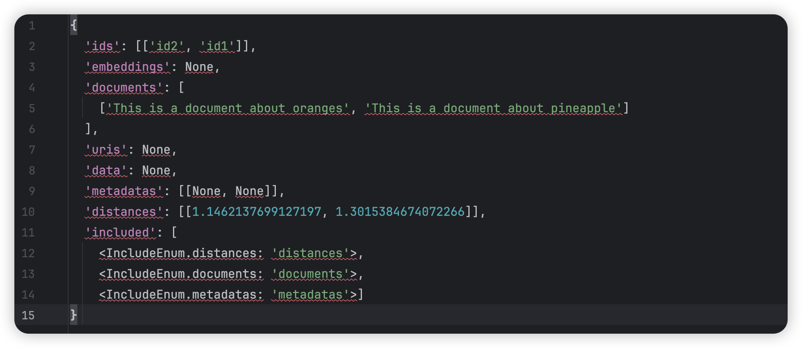

在「大模型辅助编程应用」中讲到RAG系统，我也一直想探究RAG的构建，如何在本地可以构建一把？可能和学习一门编程语言类似，先从打印输出 hello world 开始。但是，我没有找到一个不错的参考说明。如果不自己构建，当然可以直接使用其它构建好的RAG平台，但这样其实并不方便，最方便的还是在自己本地有一个RAG系统。

RAG系统最常见的方法通过独立训练的方式构建

> 从 Hugging Face 网站下载预训练的向量模型和生成模型，借助一些开源工具包便可以快速搭建一个RAG系统。

## 独立训练

下面给出基本流程示例，局部看懂了，全局就慢慢的懂了。

1. 文章切片。按照固定的窗口大小将文章切成若干片段
2. 通过OpenAI的向量接口，将每个段落转换为向量【召回模型】
3. 将用户提问的问题转换为向量
4. 比较问题的向量与所有段落的向量，得到相似程度并排序
5. 选取与提问语义最接近的一个或几个段落作为上下文，通过OpenAI的对话接口得到最终答案【生成模块】

在这个过程中，召回模块和生成模块是解耦的，可以随意替换为其它模型或API。也就是说，这两个模块是单独训练完成的，二者之间互不关联。在独立训练类型中，召回模块的向量模型可以完全复用那些经典的模型，或者使用对比损失对自己的数据进行微调，以获得更适合业务的向量模型。

独立训练存在的问题：
1. 语言模型的训练并未考虑利用召回数据，这可能导致推理过程中的数据分布存在偏差，对于参数量小的模型更容易产生幻觉
2. 向量模型并没有针对语言模型所需应对的场景和领域进行优化，这可能对模型的跨域能力提出较高的要求

### Miniforge 环境管理

后面的内容也会有提到 Miniforge 的安装，按照我当下的认知，它主要维护的 python 版本环境，如果你在安装执行 chroma 中遇到问题，建议你尝试更换 python 版本试试。

不同 python 版本差异比较大，向后兼容性不好，所以，本地安装多版本管理非常重要，在尝试了诸多手段还没有效果的情况下，不妨尝试下切换 python 版本。

pyenv 是一个用于管理多个Python版本的工具，可以方便地安装和切换不同版本的 Python。在mac环境下安装 Python 3.9.0 版本，可以使用以下步骤，这样就成功在 mac 环境下安装并切换到了Python 3.9.0 版本：

1. 首先打开终端，使用以下命令安装pyenv

```shell
brew install pyenv
```

2. 安装完成后，使用以下命令安装Python 3.9.0版本

```shell
pyenv install 3.9.0
```

3. 安装完成后，使用以下命令将全局默认的Python版本切换到3.9.0

```shell
pyenv global 3.9.0
```

安装了 miniforge 作为包管理和环境管理工具，默认会安装一个固定 Python 版本的初始化环境，如果要切换为其它版本的 Python，我们需要创建一个指定版本的环境，这很重要：

1. 创建一个新环境，环境使用 Python 3.9.0 版本，环境命名为 envpy390，想对应的路径会被存储在 miniforge3/envs 下

```shell
conda create -n envpy390 python=3.9.0
```

2. 激活环境，注意：如果没有将 miniforge 加入到PATH路径，conda 需要使用全路径
```
conda activate envpy390
```

### 安装依赖 chroma

向量数据库选用 [chroma](https://docs.trychroma.com/docs/overview/introduction) 开源数据库，图示来源于官方文档，可以通过 pip 进行安装，首先需要安装 python，一般来说，安装 python 的时候会默认安装好 pip。

```python
pip install chromadb
```


安装的核心在于python环境，尝试使用 pip、pip3安装都失败了，长叹一口气放松一下。说不准可能和之前安装的 miniconda 有关。这次我决定安装 Miniforge 作为包管理工具，Miniforge 开源免费。

安装官方提供的文档逐步进行安装，保存最终的提示输出。命令行还建议我修改 PYTHONPATH 环境变量为当前安装的地址，下面截取其中的部分输出展示：

```bash
To activate this environment, use:

    micromamba activate /Users/fuhui/miniforge3

Or to execute a single command in this environment, use:

    micromamba run -p /Users/fuhui/miniforge3 mycommand
    
If you'd prefer that conda's base environment not be activated on startup,
   run the following command when conda is activated:

conda config --set auto_activate_base false

You can undo this by running `conda init --reverse $SHELL`? [yes|no]
```

安装完成后就可以开始功能验证，文档「Getting Started」的部分详细描述了验证的流程，这么一顿操作下来，也就算是和 Chroma 有了点头的交情，欢迎入门啦。关于检索数据集中的文本内容，我是有诉求的，我预期检索的是 json 格式的文本，可以理解为服务器上打印的日志内容。

不过，这个简单的例子还是有需要思考的地方：从文本到向量生成采用了什么样的模型？如何指定向量模型、采用这个模型是否符合你的业务预期、有没有更好的向量模型呢？不过，路要一步一步走，不停步就好。

下面是我在 Mac 本地执行的结果，和官方文档的返回示例存在出入。这个示例能否正常运行，取决于你安装的 python 依赖版本。我参考了[stackoverflow](https://stackoverflow.com/questions/78745137/python-chromadb-error-unable-to-compute-the-prediction-using-a-neural-network)中的问题，将依赖 onnxruntime 的版本指定为 16.3，并按照编译要求做了调整，总算是让 demo 跑起来了。



pip 对包管理的语法看起来非常便捷，python 语法虽然简单，但工程环境中我也一直没有使用过，借助大模型这次机会，我感觉自己可能会上线一个 python 服务。当然，这些有的没的，不看实力看运气。

```python
pip install numpy<2
```

### 关于 chroma 的向量模型

chroma 是向量数据库，demo 中输入的是纯文本，从纯文本到向量的转换需要使用到向量模型，当然，它一定是内置了默认的处理模型，[all-MiniLM-L6-v2](https://docs.trychroma.com/docs/embeddings/embedding-functions#default-all-minilm-l6-v2) Sentence Transformers。在运行 demo 的过程中，就出现过下面这样的报错提示，认真阅读之后觉得不知所云。

```
return self._sess.run(output_names, input_feed, run_options)
onnxruntime.capi.onnxruntime_pybind11_state.Fail: [ONNXRuntimeError] : 1 : FAIL : Non-zero status code returned while running CoreML_12715953440113264640_1 node. Name:'CoreMLExecutionProvider_CoreML_12715953440113264640_1_1' Status Message: Error executing model: Unable to compute the prediction using a neural network model. It can be an invalid input data or broken/unsupported model (error code: -1).

```

看到信息中的关键字 「broken/unsupported model」，我差点就以为是 embeding 模型没有被正确安装，好在文档中给出了求证的示例，下面的代码可以正常输出，说明，内置的默认 embedding 模型是正常的。

```python
from chromadb.utils import embedding_functions 
default_ef = embedding_functions.DefaultEmbeddingFunction()
val = default_ef(["foo"]) 
print(val)
```

结合前面提到的 stackoverflow 的问题，锁定「onnxruntime.capi.onnxruntime_pybind11_state」关键字，尤其是 `onnxruntime` 和 `pybind11` 这两个依赖包，反正就是这么一折腾，程序就开心的 run 起来了。

回归向量模型的话题，chroma 集成对接了很多三方的矢量模型，可以通过 API 的方式进行调用，具体细节可以查看 [Embedding Functions](https://docs.trychroma.com/docs/embeddings/embedding-functions)。

我需要这样的能力，但我的诉求其实是调用我自己本地安装的矢量模型。我希望可以找到满足我需求的，更好的矢量化模型，最好可以通过数据对比得出一个最优解。