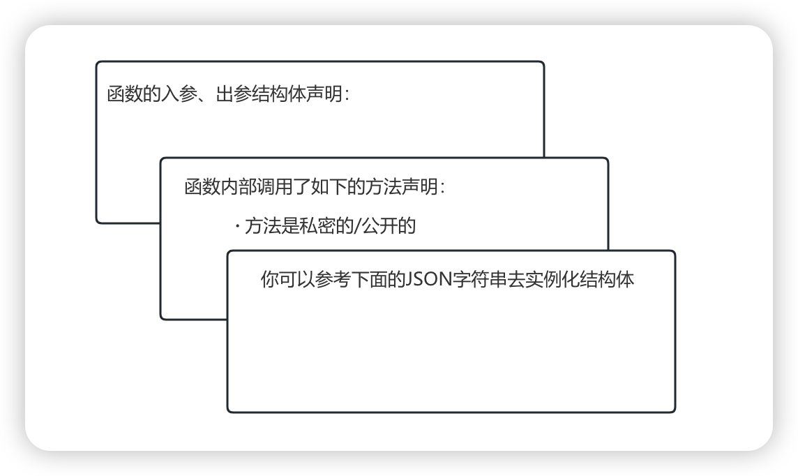

Go本地仓库构建RAG知识库，代码片段如何切片？数据切分要兼顾块与块之间的关联性，每个代码块按多少行代码进行切分，相连的代码块之间要有多少行代码重合，等等因素都会影响到RAG 的检索效果。

使用什么模型进行向量检索也是需要考量的，但目前对这部分知识的了解是比较少的。我尝试使用了别人对外提供的代码向量检索，从关键词相似性和语义相似性两个角度来进行代码查询。我的使用场景是要找出当前代码的调用上下文关系，但RAG的基于相似的检索并能不能做到这一点。

下面是Go的一个方法体，建议大家把它当看做自己业务上的某个方法，如果使用大模型对这个方法体写单元测试，大模型该如何猜测 obj 的数据类型呢？如果这个 obj 是一个特别复杂的结构体，大模型该如何实例化这个结构体中的元素呢？

```go
func (o *ObjBytes) MarshalStruct(obj interface{}) error {
    t := reflect.TypeOf(obj)
    if t.Kind() != reflect.Struct {
        panic("the kind of obj must be struct")
    }

    var buffer []byte
    v := reflect.ValueOf(obj)
    rv := *(*Value)(unsafe.Pointer(&v))
    bh := (*SliceHeader)(unsafe.Pointer(&buffer))
    bh.Data = uintptr(rv.ptr)
    bh.Len = int(t.Size())
    bh.Cap = bh.Len

    o.data = buffer
    o.iteratorStruct(v)
    o.joinOverHead()
    return nil
}
```

使用LLM写单元测试时，我首先想到的是RAG检索，如果我能通过RAG检索出来该方法体调用的上下文，以及调用中的结构体、函数依赖，通过将它们组织成 prompt 然后提交给LLM，是否可以生成比较符合预期的单测？

这样的处理方式肯定是合理的，关键在于代码块如何进行切分？反问自己一句，为什么这样的处理方式是合理的呢？还是需要结合现实中的例子进行验证。首先假设我已经实现了一套RAG的检索增强知识库，而且我检索到了预期的知识，我让LLM尝试生成单元测试，验证生成单测的效果。



我们在确认这样的处理方式确实可以生成质量更优的单元测试之后就可以动手构建这样的RAG知识库了。但现在还缺少单元测试的评判标准，这是比较关键的一环，这里暂且不做讨论，好不好肉眼还是可以看出来的。

## 代码块的切分方式

如果是纯文本切分，最简单的方式属固定大小文本切块。实际应用中，块与块之间还会专门重叠一部分文本，主要用来缓解文本块之间丢失上下文信息的问题。

