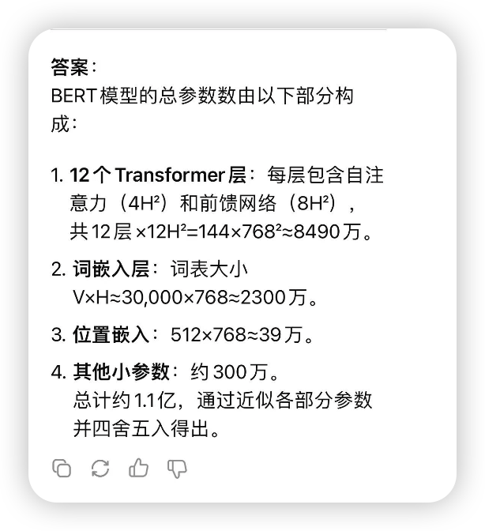

对于工程开发而言，本质上是调用了一个模型接口，也不参与模型的训练，只涉及到模型能力的使用。工程应用场景相对而言比较重要，我现在做打车的上车点推荐，基于用户的当前位置给用户推荐合适的上车点，要在这个场景使用大模型，就需要模型能力、数据收集能力有一个很大的突破才行。

## 大模型能力

大模型一旦完成训练，其内部能力和知识边界就基本固定下来。而大模型的泛化能力是指模型对未见过的数据做出准确预测或合理反应的能力

## 关于模型的名字

「DeepSeek-R1-Distill-Qwen-1.5B」模型后面加的1.5B是什么意思？

第一次接触大模型的时候，总是从模型的名字开始的，而名字后面加的1.5B让我很迷惑，Billion 表示十亿，Million表示百万，那这个1.5B的数据量是指什么？

> XL-Net模型是在一个包含39B个词库的庞大数据集上进行训练的，这些词库来自图书、维基百科和网络等文本

从上面的描述中可以了解到：39B可以指代训练模型的数据大小。但模型模型后面跟的1.5B应该不是这个意思，按照基础的认知，训练模型需要海量的数据，而1.5B的数据量应该不能代表海量。我继续寻找

> GPT-3模型是一个功能更强大的从左到右的Transformer，拥有高达175B个参数，它以相同的标准语言建模为目标，在来自Common Crawl的超过1万亿个单词的庞大数据集上进行训练。

175B表示参数的大小，这应该就是后缀1.5B的含义，它表示模型参数的大小，而非训练数据的大小。那1.5B又是如何计算的呢？

> BERT-base模型的配置可以表示为L=12、A=12、H=768，它的网络参数总数可达1.1亿个。其中，编码器的层数用L表示，注意力头的数量用A表示，隐藏神经元的数量用H表示

很显然，BERT模型可以基于这三个参数计算出来。怎么计算出来的呢，我求助了DeepSeek给出答案，答案很烧脑。

