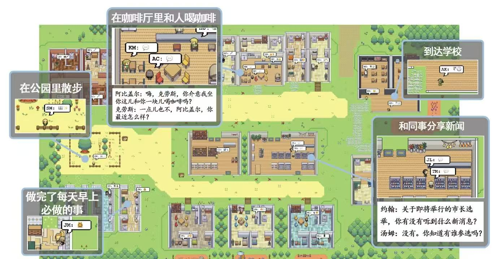

大模型不仅仅是数据处理和自然语言处理领域的传统工具，它们更是推动了Agent从静态执行者向动态决策者转变。研究人员通过思维链 CoT（Chain of Thought）、推理行动 ReAct（Reasoning and Acting）和问题分解（Problem Decomposition）等逻辑框架，引导Agent展现出推理和规划的能力。

利用大模型对自然语言的理解和生成能力，多个Agent可以在同一环境中共存并进行交互。由Agent自主构建的虚拟社会：

自动驾驶Agent也是整合视觉数据（道路标识和交通灯状态）、听觉数据和触觉数据（车辆的速度和方向控制）来快速做出决策。底层还是依赖大模型的语言交互能力和多模态能力，外部应用程序解析Agent的输出来触发对应的动作。

大模型的自主Agent的架构，其中包含规划（Planing）、记忆（Memory）、工具（Tools）、执行（Action）四大要素。其中，规划表示Agent能执行复杂任务，涉及子目标的分解（Subgoal Decomposition）、连续的思考（即思维链）、自我反思和批评（Self-critics），以及对过去行为的反思（Reflection）。