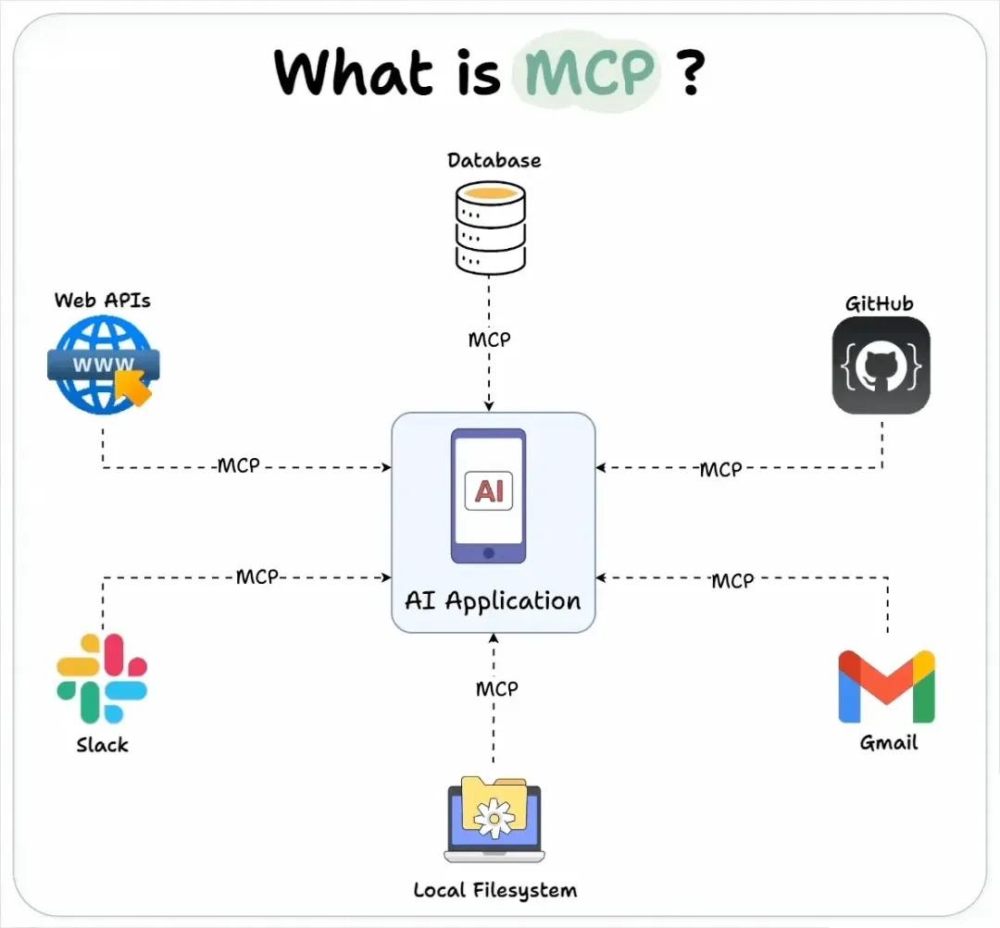
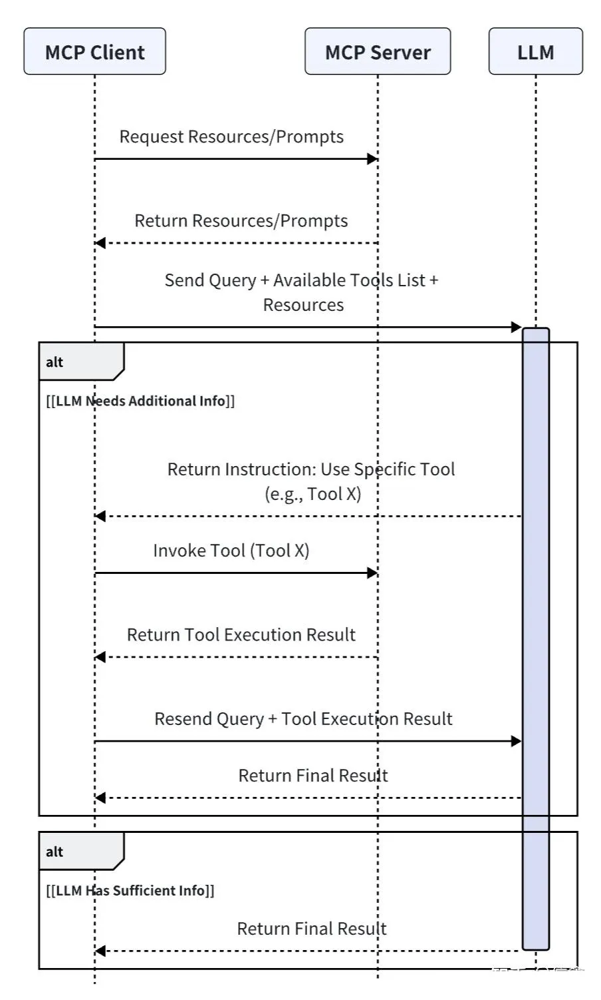
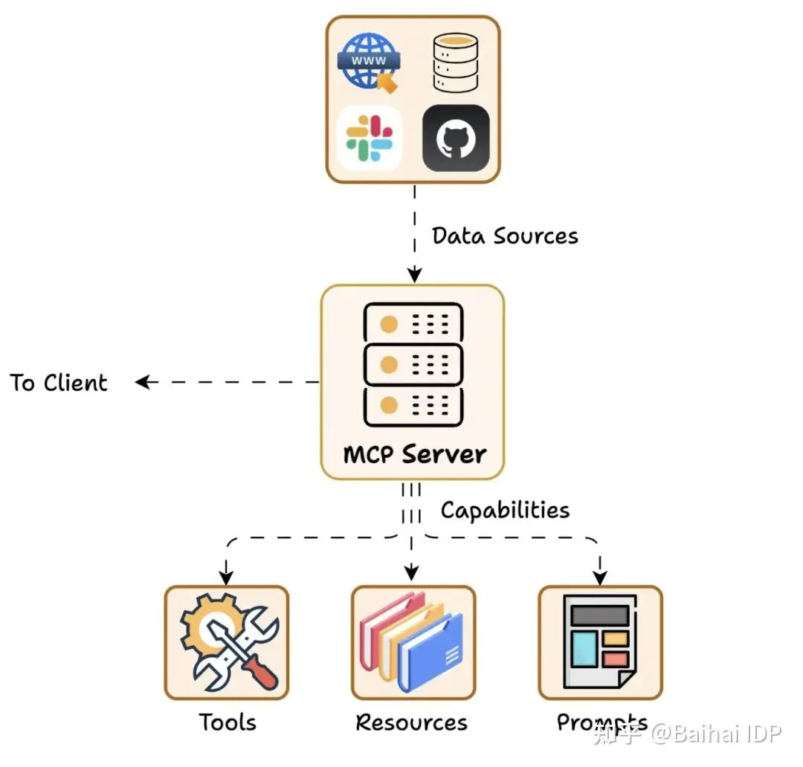
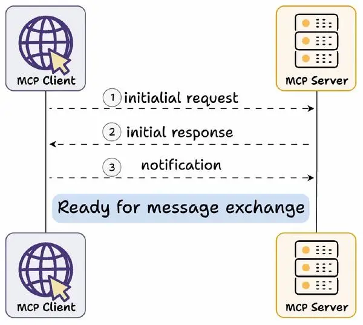

学习MCP的笔记，好记性不如烂笔头，更何况现在各种各样的资料太多了，把看到的、想到的做些整理和记录，留下点学习的痕迹。

下面这个交互图比较大，体感特别不好，但其实体现了大模型和交互链路，先和MCP交互获取数据，然后拿到数据再去和LLM交互获取结果。重复上面的交互流程，直到找到结束的标识。

 

## MCP 服务端

**Tools**：使大语言模型能够通过你的 Server 执行操作。允许服务器公开可执行的函数，这些函数可由客户端调用并由 LLM 使用来执行操作。Tool 不仅人让 LLM 能从外部获取信息，还能执行写入或操作，为 LLM 提供真正的行动力。

**Resources**：将 Server 上的数据和内容开放给大语言模型。服务器希望提供给客户端的任何类型的只读数据。这可能包括：文件内容、数据库记录、图片、日志等等。

**Prompts**：创建可复用的提示词模板和工作流程。由服务器定义的可重用的模板，用户可以选择这些模板来引导或标准化与 LLM 的交互过程。例如，Git MCP Server 可以提供一个“生成提交信息”的提示模板，用户可以用它来创建标准化的提交消息。

### 动态服务发现和适配机制

**MCP Server**    和 **MCP Client**    之间，是 一种 动态服务发现与适配机制，也叫做 能力交换   Capability Exchange 机制

首先进行 Capability Exchange（译者注：Capability Exchange（能力交换）是一种动态服务发现与适配机制，是MCP连接建立的必经步骤，类似于“握手协议”。）

Capability Exchange 流程如下：
1. 客户端发送初始请求，获取服务器能力信息
2. 服务器返回其能力信息详情
3. 例如当天气 API 服务器被调用时，它可以返回可用的“tools”、“prompts templates”及其他资源供客户端使用

交换完成后，客户端确认连接成功，然后继续交换消息。

Capability Exchange 流程 具体如何实现呢？  MCP协议官方提供了两种主要通信方式：**stdio**（标准输入输出）和 **SSE** （Server-Sent Events，服务器发送事件）。这两种方式均采用**全双工通信模式**，通过独立的读写通道实现服务器消息的实时接收和发送。

1. stdio：通过标准输入输出流进行本地通信。
2. SSE（Server-Sent Events）：通过 HTTP 协议实现服务器到客户端的实时单向数据推送，结合 HTTP POST 用于客户端到服务器的消息发送。

SSE Transport 是 MCP 中基于 HTTP 的传输方式，利用 SSE 技术实现服务器到客户端的流式消息推送，同时通过 HTTP POST 请求处理客户端到服务器的双向通信。（如果需要通过HTTP的方式提供服务，支持服务推送数据，需要使用 SSE 传输模式，还要注意，两个方向的数据交互是不相同的）

### 理解 SSE 的工作原理

SSE（Server-Sent Events）是一种基于 HTTP 协议的服务器推送技术，允许服务器向客户端发送实时更新。

## 构建 Go 版本的 MCP 服务器

要构建 Go 版本的 MCP 服务器，参考使用三方包：[mcp-go](https://github.com/mark3labs/mcp-go)，集成到服务项目中。

