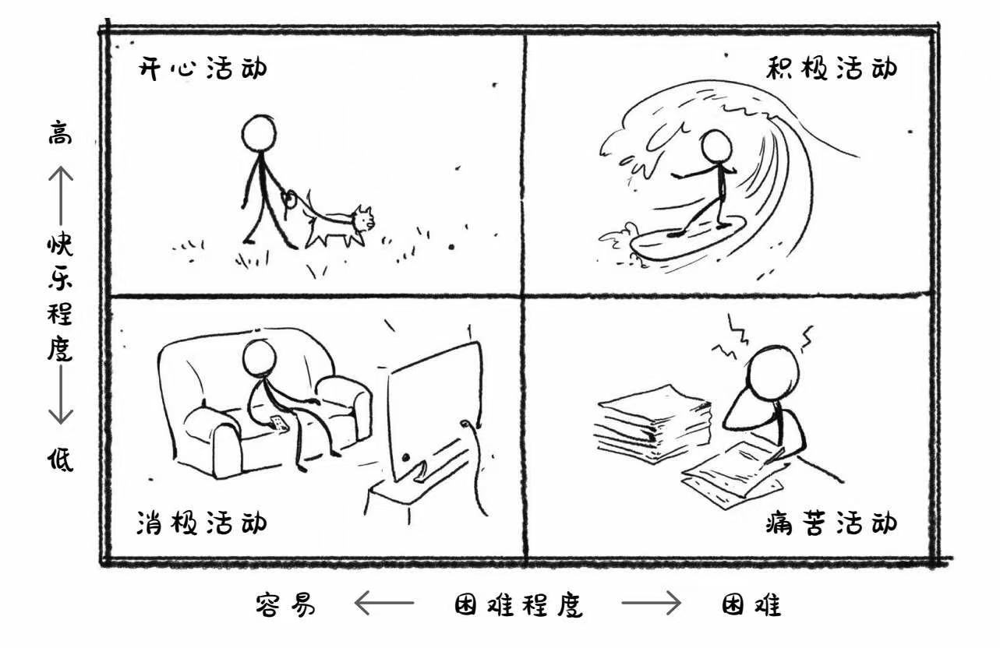

---

# Common-Defined params
title: "生活焦虑"
date: "2022-03-10"
comments: false # Enable Disqus comments for specific page
authorbox: true # Enable authorbox for specific page
pager: true # Enable pager navigation (prev/next) for specific page
mathjax: true # Enable MathJax for specific page
sidebar: "right" # Enable sidebar (on the right side) per page
widgets: # Enable sidebar widgets in given order per page
  - "recent"
---

在焦虑区和舒适区之间来回切换比固守在任何单一区域更容易带给我们刺激的感受。有些游戏没有什么难度和级别限制，玩起来也会让人开心，但我认为这种开心的感觉就像上瘾，会麻痹我们的大脑和身体，让我们把精力花在毫无意义的浮夸设计上，其目的就是让人释放更多的多巴胺，以从中获得更多的快感。

一个人一旦失去了自我控制和自我调节的能力，就只能听命于令其上瘾的活动，这时候，快乐的阴暗面就跑了出来，原本对愉快的追求也就相应地变成了一个痛苦的过程。

追求快乐一旦做的太过分，就意味着当事人失去了自控力和主动性，快乐的名声自然也会受到牵连。适度激情，自觉主动从事某项活动的强烈意愿的确可以引发正面情绪，提高生活的满意度。过分激情则无法让人获得真正意义的滋养，这种活动只要一停下来，当事人就会感觉到内心空虚。

鲁迅说：“从来如此，便对吗？”。习惯了，不等于是合理的，时刻提防自己变成一直温水里的青蛙。

有研究反复证明，残疾人，比如失去了两根手指，甚至失去了一条大腿的人，他们平时的幸福感其实跟身体健全的人没有什么区别。他们没有整天抱怨我怎么残疾了，他们想的也是健全人日常想的那些事情。甚至连那些每周必须去做透析的肾病患者，日常绝大部分时间的幸福感也不低。

他们习惯了！但不好就是不好，不能因为习惯了就接受不好。我们不能根据老百姓的忍受能力判断一个环境好不好。你习惯也好，不习惯也好，空气污染会增加疾病这个规律是不会改变的。

仔细想想工作加班，你可能已经习惯了，但这是合理的吗？

消极活动非常容易但没有任何价值，最多是能让我们安静下来。盲目机械地刷社交媒体或没完没了地看电视都属于消极活动，交浅言深的友谊及迫于无奈的应酬也属于这一类。很多人的空闲时间都给了这类活动，但消极活动对我们没有任何好处，只能把我们带向无尽的“虚无感”。

## 老鼠赛道

我们越努力，跑的就越快，要学习的知识就越多，就像笼子里的小白鼠。在老鼠赛道里，我们看起来一直在努力，可其实是在圈地打转。

> 最聪明的办法是用80%的时间学习每一个领域20%的精华。你不打通知识阻塞，只是追求看更多的文章，并不会提升你的学习效率，只是缓解了你的”知识焦虑“。

以慢为快，高效学习的秘诀就是，花慢功夫在真问题上。

其实，我明显感觉自己陷入了”知识焦虑“的怪圈，一天如果不刷一篇极客时间，心理就有些发慌。但自己并没有感受到明显的技能提升。我想好好反思，摆脱这个怪圈。

## 执着过去·逃避现实·担忧未来

经常讨论的“断舍离”，你知道每个字的具体含义吗？其中，“断”代表入口，切断输入。“舍”代表出口，舍弃多余的废物。“离”代表一种各得其所的理想状态。

对待知识的输入也是一样，我们困惑的原因也可以从这三个角度去审视。