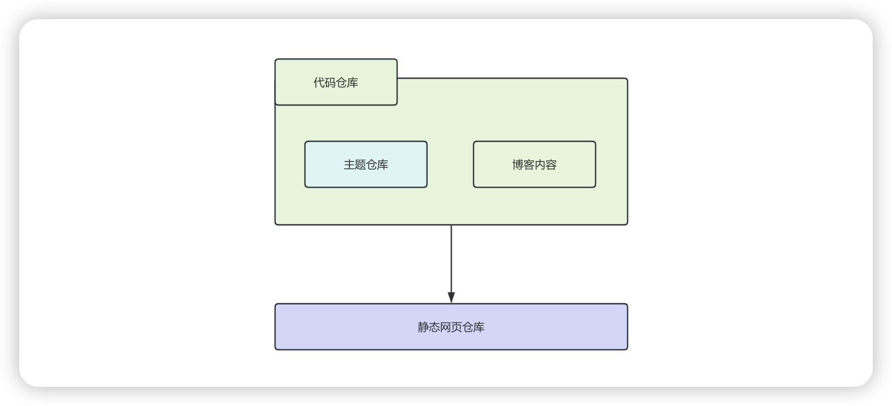
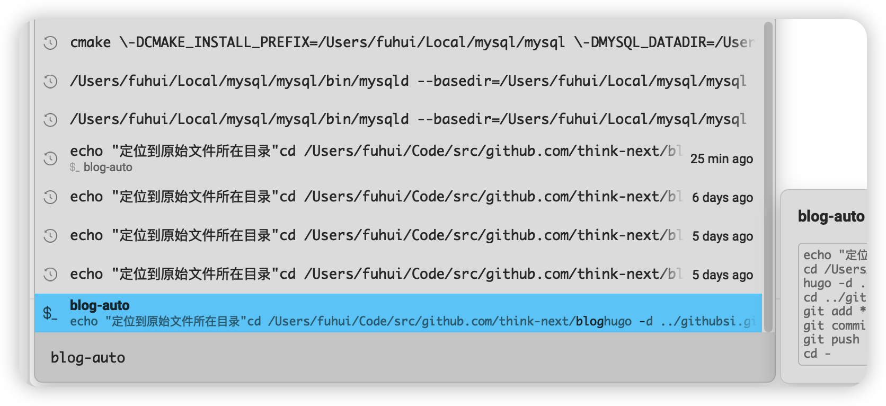
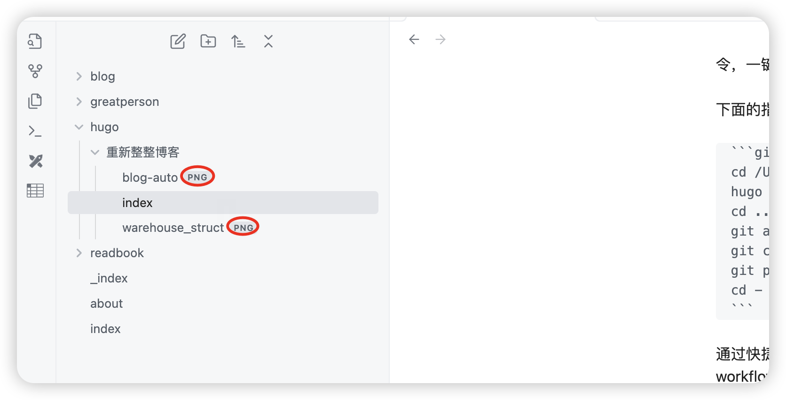

---

title: "重新整整博客·如何让编辑效率更高"
date: "2024-07-20"
comments: false
authorbox: true
pager: true
mathjax: true
sidebar: "right"
widgets:
  - "recent"
---

通过 hugo 搭建了个人博客，但博客的编辑、更新非常繁琐，空出45分钟的时间，写一篇博客已经很困难了，还需要做 hugo 静态编译。这里谈论下最近整理的相关工具，一块来让编辑提效。

目前博客的代码结构，主要涉及到2个阶段：
1. 在代码仓库中更新博客，顺带调整博客主题。主题更新会比较少，更多的其实是内容迭代
2. 对代码仓库做静态编译



## warp

warp 是一个 terminal 命名行工具，它支持自定义 workflow 是它被选择的主要原因。我需要一个命令，一键搞定代码的提交、编译工作，它恰好提供了这个能力。

下面的指令用来做静态编译，将它们定义成一个 workflow，可以节省一部分精神消耗

```git
cd /Users/fuhui/Code/src/github.com/think-next/blog
hugo -d ../githubsi.github.io
cd ../githubsi.github.io
git add *
git commit -m "update content"
git push
cd -
```

通过快捷键查找自定义的 workflow 并执行，代码提交部分就完成了。当然，还可以定义其它 workflow，比如，在本地启动 hugo 服务。



## Obsidian
Obsidian 是一款 markdown 编辑器，创建一个独立的 vault 用于编辑博客，实现文本和代码隔离的效果。

文本截图它支持的也比较好，对于粘贴到 markdown 中的截图，你可以指定图片的存放位置，默认会存放在文件所在的目录下，hugo 也恰好支持这样的图片加载方式。

下面红框标注的是这篇博客前半部分使用到的图片资源：



## 