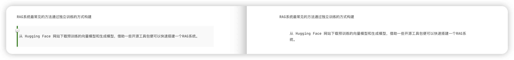

---

title: "博客迭代"
date: "2024-07-19"
comments: false
authorbox: true
pager: true
mathjax: true
sidebar: "right"
widgets:
  - "recent"
---

## v1.0.2

修改博客引用文本的样式，在 css 文件中增加对应的样式，其中 css 的加载在文件 head.html 中可以查看

```css
article .content>blockquote {
  position: relative;
  padding: 15px 20px;
  /* 给左侧绿色竖线留出空间 */
  margin: 10px 0;
  /* 根据需要调整上下外边距 */
  border-left: 4px solid green;
  /* 创建左侧绿色竖线 */
  background-color: #f9f9f9;
  /* 可选：给引用块添加背景颜色 */
}

article .content>blockquote::before {
  content: "\1F4AC";
  /* 可选：添加引号图标或其他符号作为装饰 */
  position: absolute;
  left: -10px;
  /* 调整图标位置 */
  top: 5px;
  /* 根据文本高度调整图标垂直位置 */
  font-size: 1.2em;
  /* 根据需要调整图标的大小 */
}
```


对应的模板代码如下：Hugo 静态站点生成器中用于处理 SCSS 文件并将其转换为 CSS 的模板代码，对应编辑 assets/scss/ 路径下的文件

```go
{{- $options := (dict "targetPath" "css/styles.css" "outputStyle" "compressed" "enableSourceMap" "true") -}}
{{- $styles := resources.Get "scss/style.scss" | resources.ExecuteAsTemplate "scss/style.scss" . | resources.ToCSS $options | resources.Fingerprint "sha512" }}

```

## v1.0.1
本次改动主要涉及主题样式的调整：
1. 博客标题和网站头信息的间距调整，见标注①
2. 博客元信息的样式调整，见标注②


